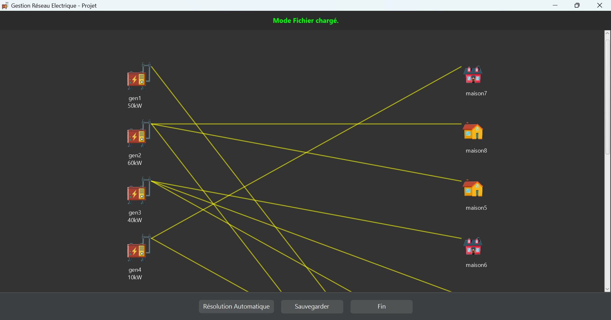
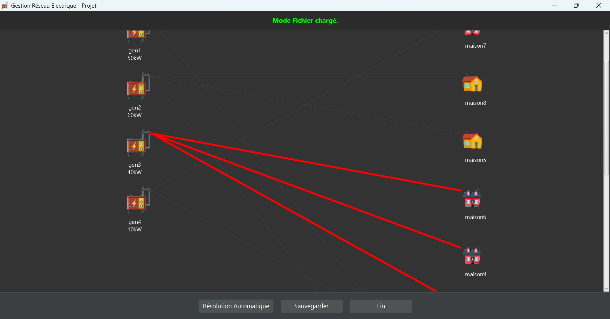
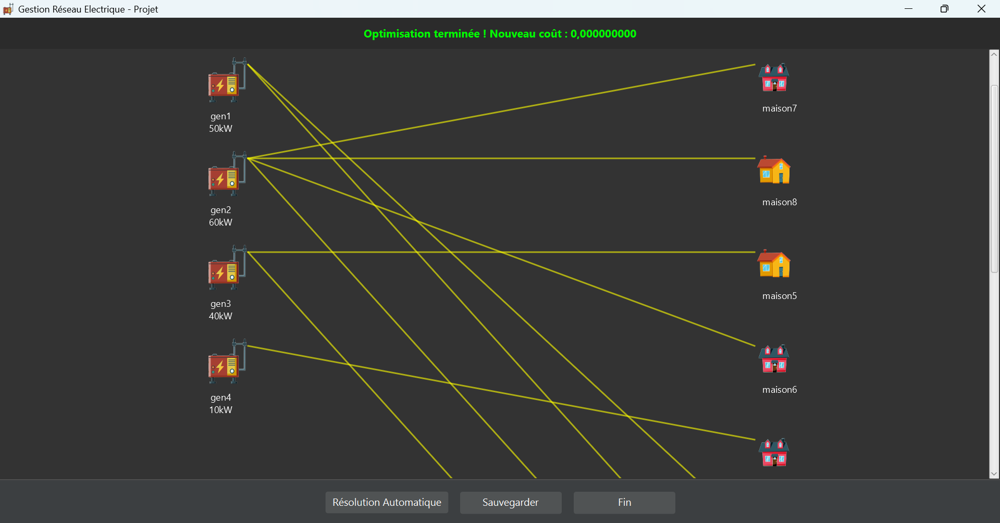
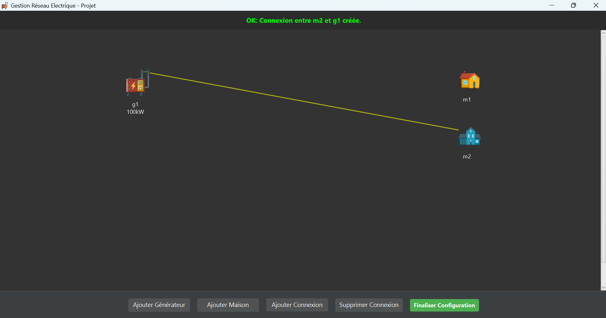
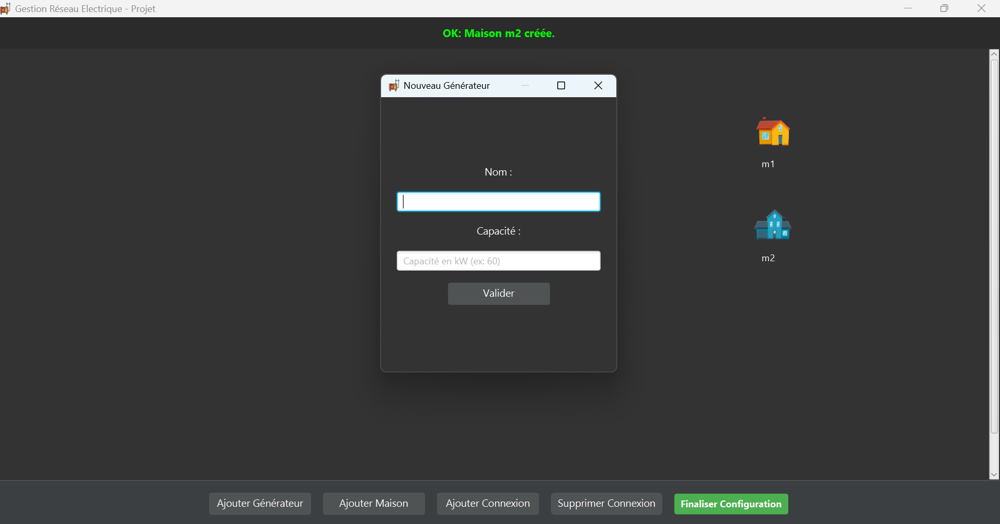
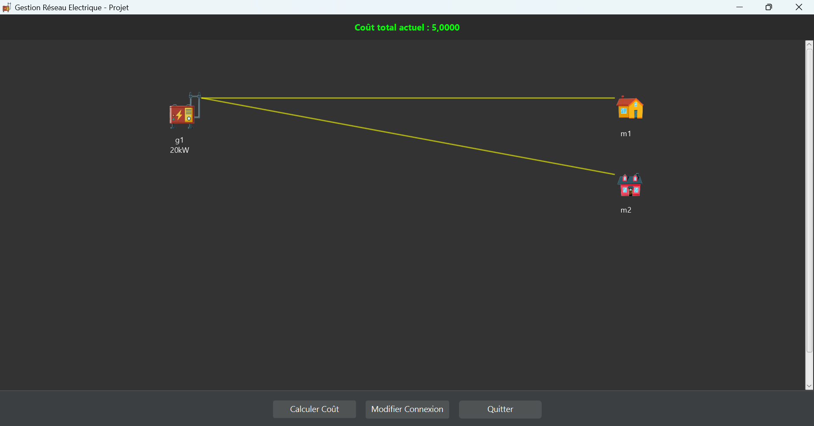

# PROJET : GESTION DE RÉSEAU ÉLECTRIQUE

## Description du Projet
Ce projet a été réalisé dans le cadre du module **Programmation Avancée et Applications** de la Licence 3 Informatique (Université Paris Cité).

Il porte sur la modélisation et l'optimisation d'un réseau de distribution d'électricité. L'application, développée en **Java** avec une interface graphique **JavaFX**, permet de concevoir un réseau (générateurs, maisons, connexions), de gérer sa persistance via des fichiers, et surtout d'optimiser les connexions pour minimiser les coûts énergétiques.

L'optimisation repose sur l'implémentation d'algorithmes avancés, notamment le **Recuit Simulé**, pour résoudre efficacement les problèmes de distribution complexe.

## Aperçu de l'Interface

Voici le rendu visuel de l'application :

### Menu Principal


### Mode Fichier
Chargement et visualisation d'instances existantes :
<p float="left">
  
   
</p>

### Optimisation
Paramétrage et lancement de l'algorithme :


### Mode Manuel
Création et édition manuelle de la topologie du réseau :
<p float="left">
  
   
</p>

### Résultats
Calcul et affichage des coûts du réseau :


---

## Documentation Technique 

**AUTEURS** : RAYANE KACHBI & MUHAMMAD ABBAS

### 1. CLASSES POUR EXECUTER LE PROGRAMME

* **A. Lancement de l'Interface Graphique** : `projet.application.MainGraphique`
* **B. Lancement en Mode Texte (Console)** : `projet.application.MainTextuelle`
* **C. Exécution via terminal** :
    Assurez-vous que les fichiers (.class) soient dans `bin`.

    *Commande Mode Manuel :*
    ```bash
    java -cp bin projet.application.MainTextuelle
    ```

    *Commande Mode Fichier* (si le lambda n'est pas inscrit il sera à 10 par défaut) :
    ```bash
    java -cp bin projet.application.MainTextuelle <CheminFichier> <Lambda>
    ```

    *Exemple :*
    ```bash
    java -cp bin projet.application.MainTextuelle Instances-20251127/instance7.txt 10.0
    ```

### 2. ALGORITHME DE RÉSOLUTION

Un algorithme d'optimisation avancé a été implémenté : le **Recuit Simulé**.

* **a) Initialisation Intelligente (Gloutonne)** :
    Avant de lancer l'optimisation, le programme trie les maisons par consommation décroissante et les connecte au générateur ayant le taux d'utilisation le plus faible à l'instant T.

* **b) Recuit Simulé** :
    L'algorithme effectue une boucle (50 000 itérations) :
    1.  **Perturbation** : Changement aléatoire d'une connexion.
    2.  **Évaluation** : Calcul du coût.
    3.  **Décision (Critère de Metropolis)** : On accepte les améliorations, et parfois les dégradations (selon la Température) pour éviter les minima locaux.
    4.  **Refroidissement** : La température diminue progressivement.

### 3. FONCTIONNALITÉS IMPLÉMENTÉES

Toutes les fonctionnalités obligatoires et bonus ont été implémentées.

**Fonctionnalités Principales :**
- [x] Modélisation orientée objet (Maison, Generateur, Reseau).
- [x] Gestion robuste des exceptions (ReseauException).
- [x] Lecture et Sauvegarde de fichiers de configuration (.txt).
- [x] Algorithme d'optimisation.
- [x] Calculs de coûts (Dispersion, Surcharge) avec paramètre Lambda modifiable.

**Fonctionnalités Bonus :**
- [x] Interface Graphique JavaFX complète et intuitive.
- [x] Tests Unitaires complets couvrant la logique métier, la gestion de fichiers et les cas limites.

### 4. STRUCTURE DU PROJET

**Code Source :**
* `src/projet/algo/` : Algorithme d'optimisation (Recuit Simulé).
* `src/projet/application/` : Points d'entrée de l'application (MainTextuelle, MainGraphique).
* `src/projet/exception/` : Gestion des erreurs personnalisées (ReseauException).
* `src/projet/interfaceFX/` : Interface graphique JavaFX (Vues et Composants).
* `src/projet/io/` : Gestion de la persistance (Lecture/Écriture de fichiers).
* `src/projet/reseau/` : Modèle métier (Reseau, Maison, Generateur).

**Tests Unitaires :**
* `tests/projet/io/` : Tests de validation de la lecture/écriture des fichiers.
* `tests/projet/reseau/` : Tests de la logique métier et des calculs du réseau.

**Ressources :**
* `Instances-20251127/` : Fichiers d'instances (.txt) pour tester le programme.
* `icones/` : Images (.png) utilisées par l'interface graphique.

### 5. SOURCES ET RÉFÉRENCES

L'algorithme d'optimisation (Recuit Simulé) implémenté dans ce projet est basé sur les travaux de :

* **Article fondateur** :
    S. Kirkpatrick, C. D. Gelatt et M. P. Vecchi, "Optimization by Simulated Annealing",
    *Science*, vol. 220, n° 4598, pp. 671–680, 1983.

* **Ressource web explicative** :
    "Le recuit simulé", Interstices.info (INRIA), 2009.
    Disponible sur : https://interstices.info/le-recuit-simule/